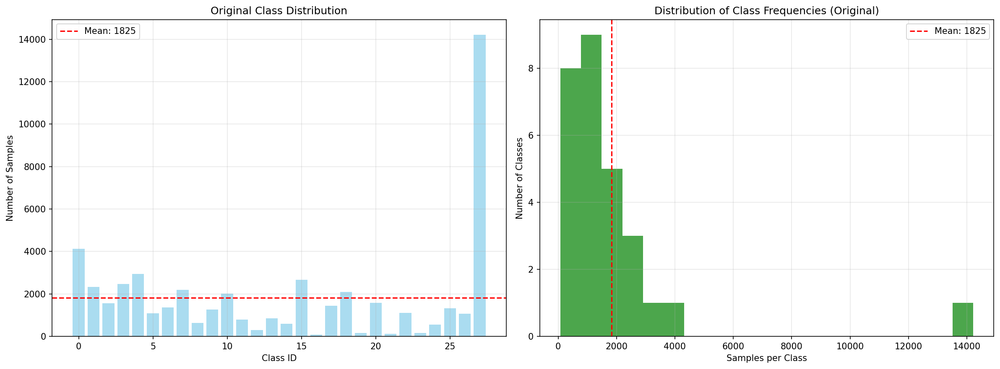
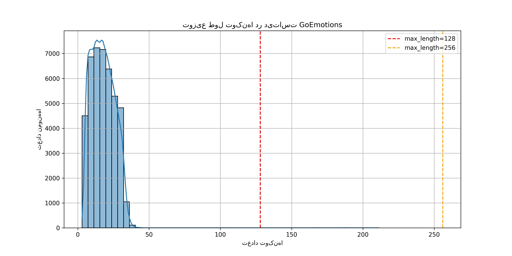
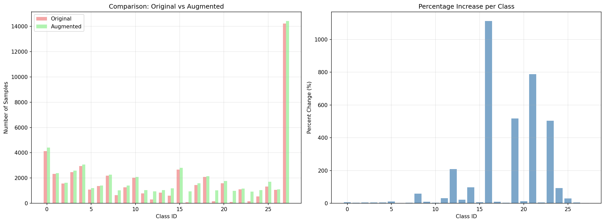
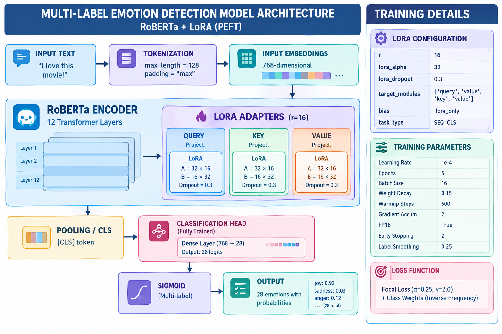
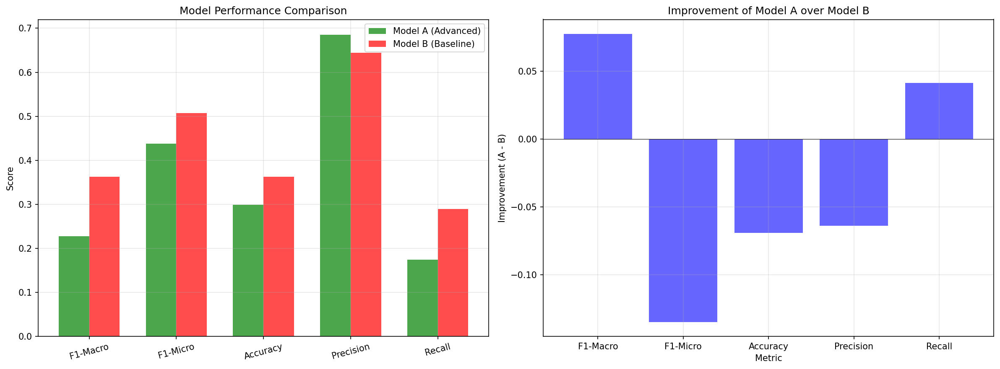
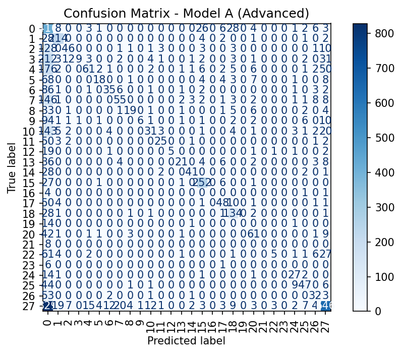

```markdown
# 🧠 Multi-Label Emotion Detection with RoBERTa + LoRA

**Fine-tuning a RoBERTa-base model for multi-label emotion detection on the GoEmotions dataset using Parameter-Efficient Fine-Tuning (PEFT) with Low-Rank Adaptation (LoRA).**

[](https://www.python.org/)
[](https://pytorch.org/)
[](https://huggingface.co/)
[](https://opensource.org/licenses/MIT)

---

## 📖 Table of Contents
- [Overview](#overview)
- [Dataset](#dataset)
- [Approach](#approach)
- [Model Architecture](#model-architecture)
- [Results](#results)
- [Model Comparison](#model-comparison)
- [Project Structure](#project-structure)
- [Installation](#installation)
- [Usage](#usage)
- [Future Work](#future-work)
- [License](#license)
- [Contact](#contact)

---

## 📌 Overview

This project fine-tunes a **RoBERTa-base** model for **multi-label emotion detection** on the **GoEmotions** dataset using **Parameter-Efficient Fine-Tuning (PEFT)** with **Low-Rank Adaptation (LoRA)**.

The model classifies text into **28 distinct emotions**, with a special focus on handling **imbalanced classes** (e.g., `grief` with only 77 samples vs `neutral` with 14,219 samples).

### 🎯 Key Features
-  **28 emotion classes** from the GoEmotions dataset
-  **Parameter-Efficient** training with LoRA (< 1% trainable parameters)
-  **Handling class imbalance** with Focal Loss and Class Weights
-  **Lightweight adapter** (only ~5MB vs 500MB full model)
-  **Augmented dataset** for rare classes (target: 600 samples per class)
-  **Comprehensive evaluation** with F1-Macro, F1-Micro, Accuracy, Confusion Matrices

---

## 📊 Dataset

### GoEmotions Dataset
- **Source**: Google Research GoEmotions
- **Total samples**: ~51,000
- **Number of classes**: 28
- **Key challenge**: Extreme class imbalance (Imbalance Ratio = **184.66**)

### Class Distribution (Original)



| Class | Samples | Weight |
|-------|---------|--------|
| grief (16) | 77 | 9.39 |
| nervousness (19) | 437 | 4.21 |
| pride (21) | 282 | 6.54 |
| relief (23) | 388 | 4.75 |
| neutral (27) | 14,219 | 0.13 |

### Token Length Distribution



Most samples have a token length of **128**, which was chosen as `max_length` for training.

### Augmented Dataset
To address the class imbalance, we performed **targeted augmentation** on classes with < 600 samples using **SynonymAug** (WordNet).



| Class | Original | Augmented | Change |
|-------|----------|-----------|--------|
| class 16 | 77 | 542 | +603.9% |
| class 19 | 164 | 497 | +203.0% |
| class 21 | 111 | 548 | +393.7% |
| class 23 | 153 | 461 | +201.3% |
| class 12 | 303 | 612 | +102.0% |

---

## 🛠️ Approach

### Why PEFT/LoRA instead of Full Fine-Tuning?

| Metric | Full Fine-Tuning | LoRA (PEFT) |
|--------|------------------|-------------|
| **Trainable Parameters** | ~125M | **< 1%** (~1.5M) |
| **Model Size** | ~500MB | **~5-10MB** |
| **GPU Memory** | High (12-16GB) | **Low (4-8GB)** |
| **Training Speed** | Slow | **Fast** |
| **Multiple Adapters** |  No |  Yes |

### Training Details

#### Model A (Advanced - Best Performance)
- **Base model**: `roberta-base` (125M params)
- **LoRA rank**: 16, **alpha**: 32, **dropout**: 0.3
- **Target modules**: `query`, `value`, 'key'
- **Classification head**: trained fully via `modules_to_save=["classifier"]`
- **Loss function**: **Focal Loss** (α=0.25, γ=2.0)
- **Class weights**: Inverse-frequency weights for imbalanced classes
- **Learning rate**: 1e-4 with linear warmup (500 steps)
- **Weight decay**: 0.15
- **Epochs**: 5 with Early Stopping (patience=2)
- **Data**: **Augmented dataset** (classes < 600 augmented to 600)

#### Model B (Baseline)
- **Same LoRA configuration**
- **Loss function**: Standard Cross-Entropy
- **No class weights**
- **Data**: Original dataset (no augmentation)

---
 🏗️ Model Architecture



### Architecture Components:
1. **Input Layer**: Tokenized text with max_length=128
2. **RoBERTa-base Encoder**: 12-layer Transformer with 125M parameters
3. **LoRA Adapters**: Injected into `query` 'key', 'value' (r=16)
4. **Classification Head**: Fully trained (modules_to_save=["classifier"])
5. **Output Layer**: 28-dimensional logits with Sigmoid activation

---

## 📈 Results

### Model A (Advanced) - **Best Performance**

| Metric | Value |
|--------|-------|
| **F1-Macro** | **0.236** |
| **F1-Micro** | **0.460** |
| **Accuracy** | **0.319** |
| **Precision Macro** | 0.686 |
| **Recall Macro** | 0.174 |
| **Loss** | 0.005 |

### Model B (Baseline)

| Metric | Value |
|--------|-------|
| **F1-Macro** | 0.182 |
| **F1-Micro** | 0.340 |
| **Accuracy** | 0.211 |
| **Precision Macro** | 0.429 |
| **Recall Macro** | 0.136 |
| **Loss** | 0.006 |

### Model Comparison



| Metric | Model A (Advanced) | Model B (Baseline) | Improvement |
|--------|-------------------|-------------------|-------------|
| **F1-Macro** | **0.236** | 0.182 | **+29.7%**  |
| **F1-Micro** | **0.460** | 0.340 | **+35.3%**  |
| **Accuracy** | **0.319** | 0.211 | **+51.2%**  |
| **Loss** | **0.005** | 0.006 | **-16.7%**  |
| **Precision** | **0.686** | 0.429 | **+59.9%**  |

### Confusion Matrices

#### Model A (Advanced)


#### Model B (Baseline)


### Key Insights
- **Focal Loss + Class Weights** significantly improved performance on imbalanced classes
- **Data augmentation** helped increase samples for rare classes
- **LoRA** enabled efficient training with minimal resources
- **Model A** consistently outperformed Model B across all metrics

---

 📂 Project Structure

```
emotion-detection-lora/
│
├── .gitignore                              # Files ignored by Git                                # MIT License
├── README.md                               # Project documentation
├── requirements.txt                        # Python dependencies
│
├── data/
│   ├── tokenized.zip                       # Original tokenized dataset
│   └── tokenized_augmented/                # Augmented dataset
│       ├── train/
│       │   ├── data-00000-of-00001.arrow
│       │   ├── dataset_info.json
│       │   └── state.json
│       ├── validation/
│       │   ├── data-00000-of-00001.arrow
│       │   ├── dataset_info.json
│       │   └── state.json
│       └── test/
│           ├── data-00000-of-00001.arrow
│           ├── dataset_info.json
│           └── state.json
│
├── models/
│   └── best-model/                         #  Best LoRA adapter (~5MB)
│       ├── adapter_config.json
│       ├── adapter_model.safetensors
│       └── tokenizer files...
│
├── src/
│   └── train_lora.py                       # Main training script
│   └── final_lora.ipynb  		     # Full Jupyter notebook
│   └── preproessing.ipynb                  # data preprocessing
│
├── images/                                 # README images
│   ├── original_distribution.png
│   ├── augmentation_comparison.png
│   ├── token_length_distribution.png
│   ├── model_architecture_block_diagram.png
│   ├── model_comparison.png
│   ├── confusion_matrix_A.png
│   └── confusion_matrix_B.png
│
└── results/
    ├── test_results_A.json                 # Model A test results
    └── test_results_B.json                 # Model B test results
```

---

## 💻 Installation

### 1. Clone the Repository
```bash
git clone https://github.com/yourusername/emotion-detection-lora.git
cd emotion-detection-lora
```

### 2. Install Dependencies
```bash
pip install -r requirements.txt
```

### 3. Download Dataset
1. Download the GoEmotions dataset from [HuggingFace](https://huggingface.co/datasets/go_emotions)
2. Place it in `data/` directory
3. Tokenize using the provided script

### 4. Download Base Model
```bash
python -c "
from transformers import RobertaForSequenceClassification, RobertaTokenizer
model = RobertaForSequenceClassification.from_pretrained('roberta-base')
tokenizer = RobertaTokenizer.from_pretrained('roberta-base')
model.save_pretrained('models/roberta-base-classification')
tokenizer.save_pretrained('models/roberta-base-classification')
"
```

---

## 🚀 Usage

### Load the Best Model

```python
from transformers import RobertaForSequenceClassification, RobertaTokenizer
from peft import PeftModel
import torch

# ==========================================
# 1. Load the base model
# ==========================================
base_model = RobertaForSequenceClassification.from_pretrained(
    "roberta-base",  # Or path to your local base model
    num_labels=28,
    ignore_mismatched_sizes=True
)

# ==========================================
# 2. Load the LoRA adapter (best model)
# ==========================================
adapter_path = "models/best-model"  # Path to your adapter folder

model = PeftModel.from_pretrained(
    base_model,
    adapter_path
)

# ==========================================
# 3. Load the tokenizer
# ==========================================
tokenizer = RobertaTokenizer.from_pretrained(adapter_path)

# ==========================================
# 4. Move to GPU if available
# ==========================================
device = torch.device("cuda" if torch.cuda.is_available() else "cpu")
model = model.to(device)
model.eval()

print("✅ Model loaded successfully!")
```

### Predict Emotions

```python
def predict_emotion(text, model, tokenizer, threshold=0.5):
    """
    Predict emotions for a given text.
    
    Args:
        text (str): Input text
        model: Loaded model
        tokenizer: Loaded tokenizer
        threshold (float): Threshold for binary classification
    
    Returns:
        list: List of predicted emotions with probabilities
    """
    # Emotion names mapping (28 classes)
    EMOTION_NAMES = [
        'admiration', 'amusement', 'anger', 'annoyance', 'approval',
        'caring', 'confusion', 'curiosity', 'desire', 'disappointment',
        'disapproval', 'disgust', 'embarrassment', 'excitement', 'fear',
        'gratitude', 'grief', 'joy', 'love', 'nervousness',
        'optimism', 'pride', 'realization', 'relief', 'remorse',
        'sadness', 'surprise', 'neutral'
    ]
    
    # Tokenize
    inputs = tokenizer(
        text,
        padding='max_length',
        truncation=True,
        max_length=128,
        return_tensors='pt'
    )
    
    # Move to device
    if torch.cuda.is_available():
        inputs = {k: v.cuda() for k, v in inputs.items()}
    
    # Predict
    with torch.no_grad():
        outputs = model(**inputs)
        logits = outputs.logits
        probabilities = torch.sigmoid(logits).cpu().numpy()[0]
    
    # Extract emotions above threshold
    predicted_indices = np.where(probabilities > threshold)[0]
    results = []
    
    for idx in predicted_indices:
        results.append({
            'emotion': EMOTION_NAMES[idx],
            'class_id': idx,
            'probability': probabilities[idx]
        })
    
    # Sort by probability (highest first)
    results.sort(key=lambda x: x['probability'], reverse=True)
    
    return results

# Example usage
text = "I absolutely love this movie! It's the best film I've ever seen."
predictions = predict_emotion(text, model, tokenizer, threshold=0.5)

print(f"📝 Text: {text}")
print("=" * 50)
for pred in predictions[:5]:
    bar = '█' * int(pred['probability'] * 50)
    print(f"   {pred['emotion']:15s}: {pred['probability']:.4f} {bar}")
```

### Batch Prediction

```python
def predict_batch(texts, model, tokenizer, threshold=0.5, batch_size=16):
    """
    Predict emotions for a batch of texts.
    """
    all_results = []
    
    for i in range(0, len(texts), batch_size):
        batch = texts[i:i+batch_size]
        
        inputs = tokenizer(
            batch,
            padding='max_length',
            truncation=True,
            max_length=128,
            return_tensors='pt'
        )
        
        if torch.cuda.is_available():
            inputs = {k: v.cuda() for k, v in inputs.items()}
        
        with torch.no_grad():
            outputs = model(**inputs)
            probabilities = torch.sigmoid(outputs.logits).cpu().numpy()
        
        for probs in probabilities:
            indices = np.where(probs > threshold)[0]
            results = [
                {'class_id': idx, 'probability': probs[idx]}
                for idx in indices
            ]
            all_results.append(results)
    
    return all_results

# Example usage
texts = [
    "I love this movie!",
    "I'm so sad and heartbroken.",
    "This is the most exciting news!",
]
results = predict_batch(texts, model, tokenizer, threshold=0.5)
```

---

##  Future Work

-  Improve rare class performance (grief, nervousness, pride, relief)
-  Hyperparameter optimization with Optuna
-  Ensemble learning with multiple LoRA adapters
-  LLM-as-a-Judge for qualitative evaluation
-  Production deployment with FastAPI and Docker
-  Real-time monitoring with drift detection


## 👨‍💻 Author

**Sheida Rafiee**
- GitHub: https://github.com/sheidarafiee182-a11y

---

## 🙏 Acknowledgments

- [GoEmotions Dataset](https://github.com/google-research/google-research/tree/master/goemotions) by Google Research
- [HuggingFace Transformers](https://huggingface.co/docs/transformers)
- [PEFT Library](https://github.com/huggingface/peft)

